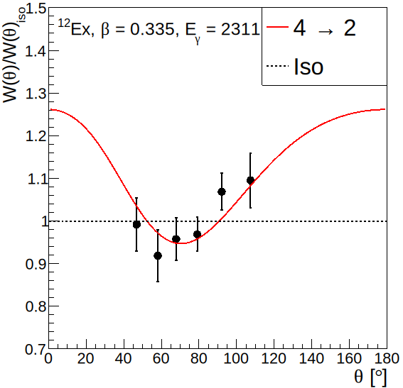

# Angular Distribution Fitter
This python script will plot and fit angular distribution data to obtain the alignment and degree of polarization percentages. It uses [SymPy](https://www.sympy.org/en/index.html), [Numpy](https://numpy.org), [SciPy](https://scipy.org), and [PyROOT](https://root.cern/manual/python/) (tested using with ROOT version 6.28.04). 

The figure above was generated using the following command:
`python3 -i adFitter.py source.dat example_data.dat 12Ex Obl 2311 4 2 0.0`

To generate pseudo data run the same command with the number of experiments to run:
`python3 -i adFitter.py source.dat example_data.dat 12Ex Obl 2311 4 2 0.0 500`

To make histograms for all fit parameter and derived parameter distributions, use:
`python3 makeDistHists.py <your psuedo_data.dat file>`

`makeDistHists.py` also generates a `.stats` file that contains hypothesis test and best fit p-values that can be added to the angular distribution fit legend. This can be plotted using:
`python3 -i adFitter.py source.dat example_data.dat 12Ex Obl 2311 4 2 0.0 <your matching .stats file>`